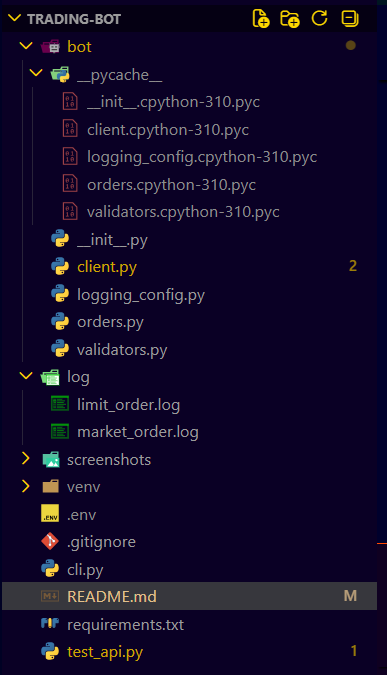
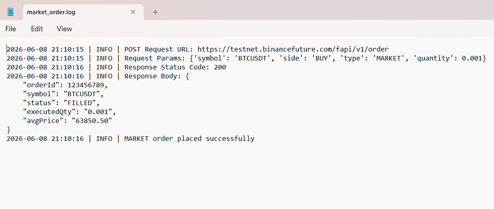
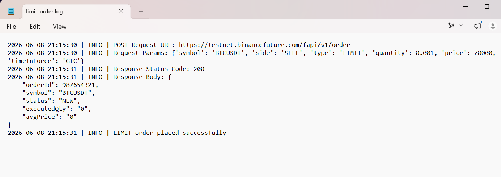
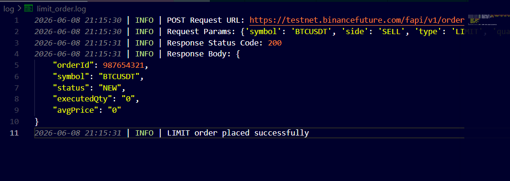

# Binance Futures Testnet Trading Bot

A Python-based command-line trading bot that interacts with the Binance USDT-M Futures Testnet. The application allows users to place MARKET and LIMIT orders, supports both BUY and SELL operations, validates user inputs, logs API interactions, and handles errors gracefully.

## Features

* Place MARKET orders on Binance Futures Testnet
* Place LIMIT orders on Binance Futures Testnet
* Support for BUY and SELL order sides
* Command-line interface using argparse
* Input validation
* Structured and modular codebase
* Logging of API requests, responses, and errors
* Robust exception handling

---

## Project Structure

```text
Trading-Bot/
│
├── bot/
│   ├── __init__.py
│   ├── client.py
│   ├── orders.py
│   ├── validators.py
│   └── logging_config.py
│
├── logs/
│   └── trading_bot.log
│
├── cli.py
├── README.md
├── requirements.txt
└── .gitignore
```

---

## Screenshots

### Project Structure



### MARKET Order Execution



### LIMIT Order Execution



### Generated Logs



---

## Installation

### Clone the Repository

```bash
git clone https://github.com/mishita27twr/Trading-Bot.git
cd Trading-Bot
```

### Create a Virtual Environment

```bash
python -m venv venv
```

### Activate the Virtual Environment

Windows:

```bash
venv\Scripts\activate
```

### Install Dependencies

```bash
pip install -r requirements.txt
```

---

## Configuration

Create a `.env` file in the project root directory:

```env
BINANCE_API_KEY=your_api_key
BINANCE_API_SECRET=your_api_secret
BINANCE_BASE_URL=https://testnet.binancefuture.com
```

---

## Usage

### MARKET Order

```bash
python cli.py --symbol BTCUSDT --side BUY --type MARKET --quantity 0.001
```

### LIMIT Order

```bash
python cli.py --symbol BTCUSDT --side SELL --type LIMIT --quantity 0.001 --price 70000
```

---

## Example Output

### Order Request Summary

```text
Order Request Summary
---------------------
Symbol: BTCUSDT
Side: BUY
Order Type: MARKET
Quantity: 0.001
```

### Order Response

```text
Order ID: 123456789
Status: FILLED
Executed Quantity: 0.001
Average Price: 63850.50

Success: Order placed successfully.
```

---

## Logging

All API requests, responses, and errors are automatically recorded in:

```text
logs/trading_bot.log
```

Example:

```text
POST Request URL: https://testnet.binancefuture.com/fapi/v1/order
Response Status Code: 200
Order placed successfully
```

---

## Error Handling

The application handles:

* Invalid order side
* Invalid order type
* Missing price for LIMIT orders
* Invalid quantity values
* API authentication errors
* Network failures
* Binance API exceptions

---

## Assumptions

* Only Binance USDT-M Futures Testnet is supported.
* Symbols must be provided in Binance format (e.g., BTCUSDT).
* LIMIT orders use GTC (Good Till Cancelled).
* API credentials are stored securely in a local `.env` file.
* `.env` is excluded from version control.

---

## Challenges Faced

* Understanding Binance Futures Testnet authentication.
* Implementing secure request signing using HMAC SHA256.
* Handling API and network-related exceptions.
* Designing a modular and reusable project structure.
* Creating detailed logging while keeping sensitive data secure.

---

## Future Enhancements

* Support for Stop-Limit orders.
* Interactive CLI menus.
* Real-time market data integration.
* Trading strategy automation.
* Web-based dashboard for monitoring orders.

---

## Author

**Mishita Tiwari**

* GitHub: https://github.com/mishita27twr

---

## Support

If you encounter any issues or have suggestions for improvement, feel free to open an issue in the repository.
